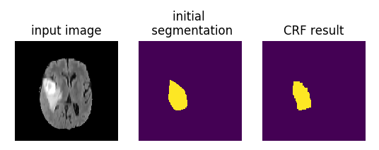
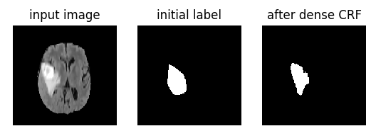
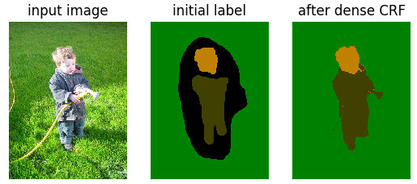

# SimpleCRF
Matlab and Python wrap of Conditional Random Field (CRF) and fully connected (dense) CRF for 2D and 3D image segmentation, according to the following papers:

[1] Yuri Boykov and Vladimir Kolmogorov, "An experimental comparison of min-cut/max-flow algorithms for energy minimization in vision", in IEEE TPAMI, 2004.

Pushmeet Kohli and Philip H.S. Torr. "Efficiently solving dynamic markov random fields using graph cuts", ICCV, 2005

[2] Philipp Krähenbühl and Vladlen Koltun, "Efficient inference in fully connected crfs with gaussian edge potentials", in NIPS, 2011.

[3] Kamnitsas et al. "Multi-scale 3D convolutional neural networks for lesion segmentation in brain MRI", in Proceeding of ISLES challenge, MICCAI, 2015.

# Dependency
This repository depends on the following packages:

* Maxflow  https://vision.cs.uwaterloo.ca/code/ 

* DenceCRF http://graphics.stanford.edu/projects/drf/

* 3D Dense CRF https://github.com/deepmedic/dense3dCrf

# Examples
Some demos of using this package are:

* `examples/demo_maxflow.py`: using maxflow for automatic and interactive segmentation of 2D and 3D images.

* `examples/demo_densecrf.py`: using dense CRF for 2D gray scale and RGB image segmentation.

* `examples/demo_densecrf3d.py`: using 3D dense CRF for 3D multi-modal image segmentation.

# Modules
* `maxflow` has four functions as follows. Note that the current version only support binary segmentation.

** maxflow.maxflow2d() for 2D automatic segmentation.

** maxflow.interactive_maxflow2d() for 2D interactive segmentation.

** maxflow.maxflow3d() for 3D automatic segmentation.

** maxflow.interactive_maxflow3d() for 3D interactive segmentation.

