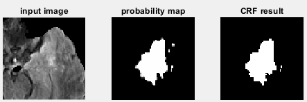

# Matlab wrap of maxflow for 2D image segmentation
This package is a Matlab wrap of maxflow algorithm written in cpp.

To build, run the `make.m` file. 

See `test1.m` and 'test2.m' for examples of using this package. 

