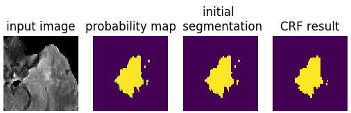

# Python wrap of maxflow for 2D and 3D image segmentation
This package is a Python wrap of maxflow algorithm written in cpp.

To build and install, run the following commands: 

```bash
python setup.py build
python setup.py install
```

This will install two packages: max_flow and max_flow3d. See test.py for examples of using these packages. 


