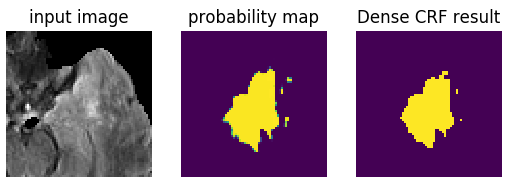

# Python wrap of dense CRF for 2D image segmentation
This package is a Python wrap of 2D fully connected (dense) CRF algorithm written in cpp.

To build and install, run the following commands: 

```bash
python setup.py build
python setup.py install
```

This will install a package named as `dense_crf`. See `test.py` for examples of using this package. 


